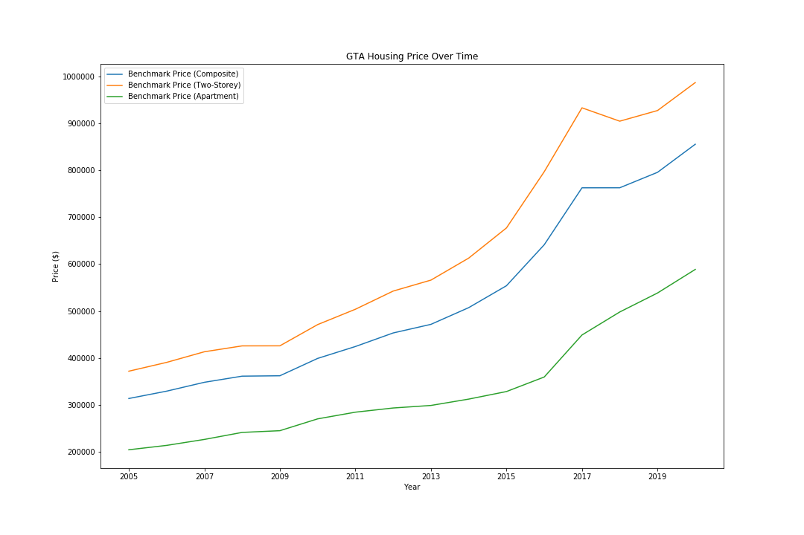

# Ontario Housing Prices and Income Trends

The project analyses the change in the housing prices over time in Southern Ontario region. We have also analysed if there is any increase or decrease in the housing prices due to Covid-19 pandemic.

Below are the questions which we want to answer with the help of data:

* How are housing prices changing over time? 
* What are the housing price trends across different regions in Southern Ontario ( 2015 vs 2020)?
* How has housing affordability changed over time?
* How has housing prices been affected by COVID-19?

# Source of Dataset:

Housing Prices by Year and Area:
 * CREA - The Canadian Real Estate Association Website
   https://creastats.crea.ca/en-CA/

Income by Year and Area:
 * Canada Revenue Agency Website
   https://www.canada.ca/en/revenue-agency/programs/about-canada-revenue-agency-cra/income-statistics-gst-hst-statistics/individual-tax-statistics-area-itsa.html

# Data cleaning process involves the following steps:

* Housing prices data only had 8 rows containing missing (n/a) values.
* Very complete data source.
* Final housing data frame consisted of 1110 rows and 8 columns.
* Renamed column headers and dropped columns not needed for analysis.
  * Made the data more readable and easier to analyze.
  * Renamed the different Regions.
  * Split the date column into Year and Month.
* Formatted the final Housing Prices data frame.
  * Round benchmark prices to two decimal places.
  * Added dollar ($) signs for units and commas ( , ) for readability.
* Grouped Housing Prices data frame by Region and Year.

# Conclusions:

* Housing prices are increasing, with occasional fluctuations due policy and regulatory changes across all regions.
* Housing prices have increased across all regions between 2015 and 2020
  * The GTA and the Oakville & Milton regions saw the largest increase in price and are the most expensive regions for any type of housing.
* Housing affordability has decreased over time across all regions at different rates.
  * The price of a house is 14.5 times more than the average income in 2017 in the GTA.
  * 4 times more as compared to three years before in 2014 (GTA).
* All regions have saw an increase in housing prices since the COVID-19 outbreak
  * Guelph saw a lower rate of increase in housing prices from January to May (2019 vs. 2020)
  * Delay in housing market changes due to closing time periods

# Insights:

* Expect further increases in housing prices over  the next several years, across all regions analysed for Southern Ontario.
* Prices for two-storey housing are increasing faster than apartments. This trend is expected to continue due to land scarcity in populated regions.
* Housing prices and income are based on different factors and do not change at the same rate. Housing prices are expected to increase more compared to income.
  * Housing markets usually have excess demand = higher increase in prices.
  * Job markets usually have excess supply of labor = lower increase of wages.
* Housing Prices are currently increasing, even during COVID-19, however more time is needed to accurately analyse the effect of COVID-19 on housing prices.

